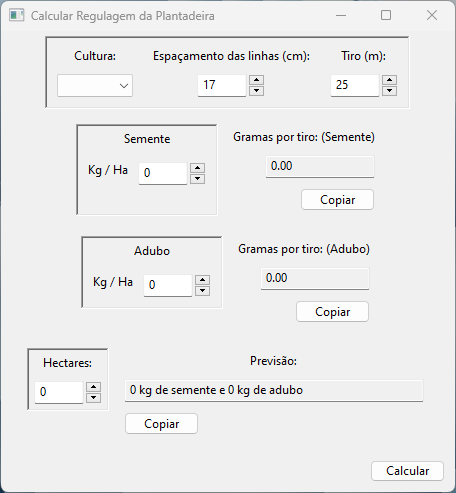
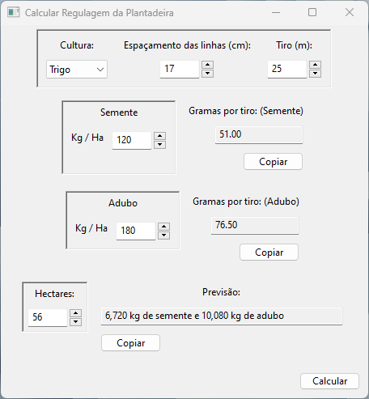

# Calculadora para fazer regulagem de plantadeira

Colocando as quantidades em quilo por hectare de semente e adubo, o programa vai apresentar as quantidades em gramas para fazer a regulagem numa área menor.

*****

## Imagens:

 
<b>Janela padrão no Windows</b>

 
<b>Janela com valores calculados</b>

*****

## O cálculo:

> Área de teste (hectares) **=** **(** Espaçamento **x** Tiro **)** **/** 100

Aplicando a regra de três:

> Alvo  -> 1 Hectare  
> Teste(?) ->  Área de teste

> Teste **x** 10 000 m² **=** Alvo **x** **(** Espaçamento **x** Tiro **)** **/** 100

Simplificando:

> Teste **=** ( Alvo **x** Espaçamento **x** Tiro ) **/** 1000

- *Teste*: Quantidade que a plantadeira deve soltar na regulagem (em gramas)
- *Alvo*: Quilos por hectare
- *Espaçamento*: Distância entre uma linha e outra (em centímetros)
- *Tiro*: Comprimento da área de teste

Os valores padrão são 17 centímetros de espaçamento e 25 metros de tiro, mas podem ser alterados.

Colocando quantos hectares serão plantados, também ‚ possível ter uma previsão do total a ser gasto.

A seleção de culturas não afeta o funcionamento do programa (na versão atual).
