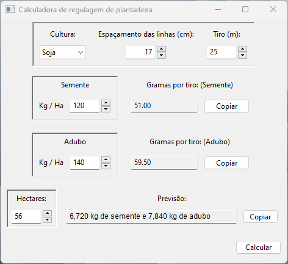
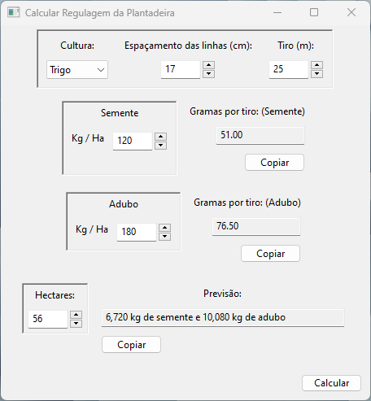

# Calculadora para fazer regulagem de plantadeira

Colocando as quantidades em quilo por hectare de semente e adubo, o programa vai apresentar as quantidades em gramas para fazer a regulagem numa área menor.

*****

## Imagens:
<table>
	<thead>
		<tr>
			<th>Janela padrão no Windows</th>
			<!--th>Janela com valores calculados</th-->
		</tr>
	</thead>
	<tbody>
		<tr>
			<td>
				
			</td>
			<!--td>
				
			</td-->
		</tr>
	</tbody>
</table>

*****

## Utilização

Os valores padrão são 17 centímetros de espaçamento e 25 metros de tiro, mas podem ser alterados.

Colocando quantos hectares serão plantados, também é possível ter uma previsão do total a ser gasto.

A seleção de culturas não afeta o funcionamento do programa (na versão atual).

## O cálculo:

Os dados necessários para realizar o cálculo:

- *Alvo*: Quantide de quilos a cair por hectare
- *Espaçamento*: Distância entre uma linha e outra (em centímetros)
- *Tiro*: Comprimento da área de teste

A quantidade que a plantadeira deve soltar na regulagem (em gramas) será chamada de *Teste*.

A relação entre os dados:

$$ \textrm{Alvo}\ kg \longrightarrow \textrm{1 Hectare}\ m^2 $$

$$ \textrm{Teste} \longrightarrow \textrm{Área de teste}\ m^2 $$

Aplicando a regra de três, temos a equação 1:

$$ \textrm{Teste} \cdot 10000 m^2 = \textrm{Alvo}\ kg  \cdot  \textrm{Área de teste}\ m^2 $$

Como o espaçamento é medido em centímetros e o tiro em metros, o valor da área de teste também pode ser descrito como:

$$ \textrm{Área de teste}\ m^2 = \textrm{Espaçamento}\ cm \cdot \textrm{Tiro}\ m $$

Substituindo na equação 1:

$$ \textrm{Teste} \cdot 10000 m^2 = \textrm{Alvo}\ kg \cdot \textrm{Espaçamento}\ cm \cdot \textrm{Tiro}\ m $$

Convertendo o alvo para a unidade de gramas e o espaçamento para metros:

$$ \textrm{Teste} \cdot 10000 m^2 = \textrm{Alvo}\ g \cdot 1000 \cdot { \textrm{Espaçamento} \over 100 } \ m \cdot \textrm{Tiro}\ m $$

Simplificando:

$$ \textrm{Teste} = { \textrm{Alvo} \cdot \textrm{Espaçamento} \cdot \textrm{Tiro} \over 1000 }\ g $$
